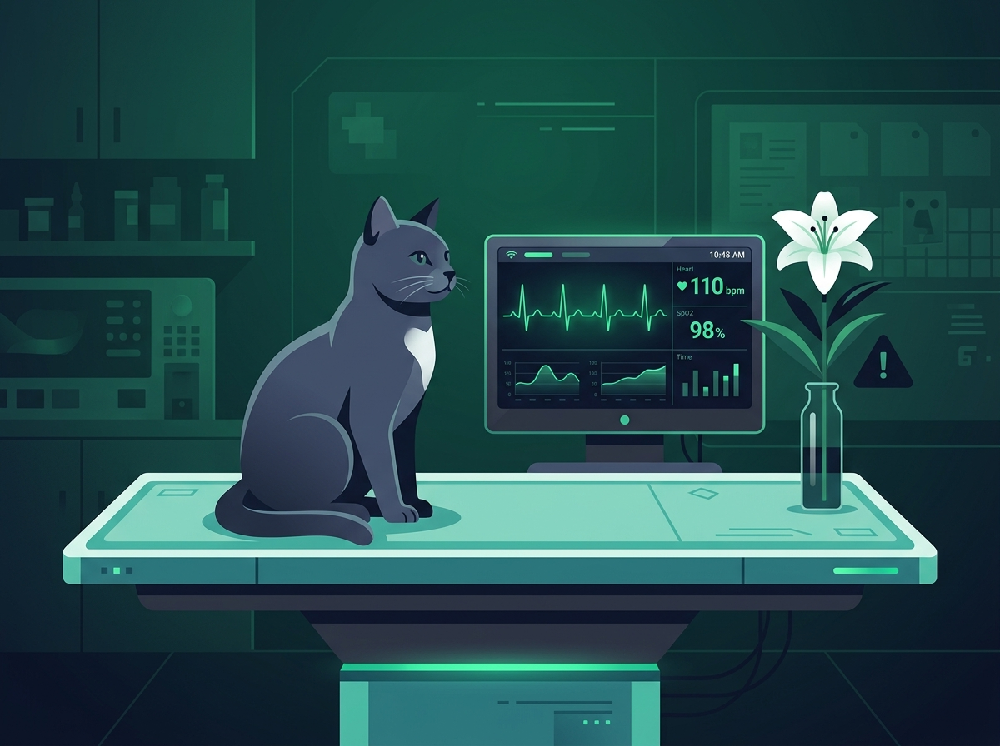
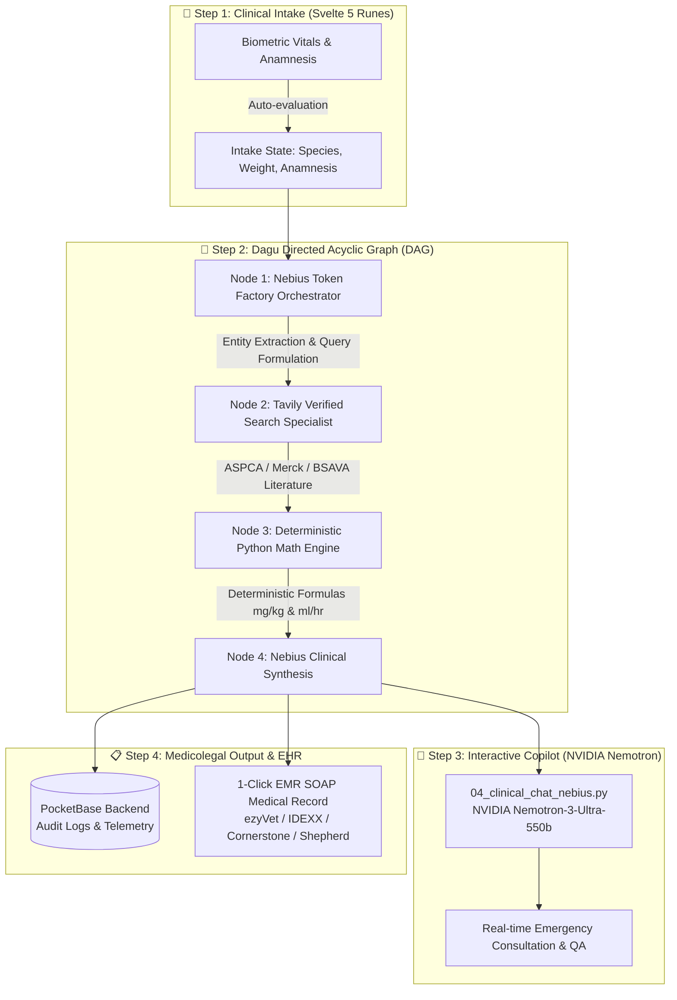

<div align="center">

# 🐾 VetSentinel · Veterinary Emergency & Clinical Toxicology Copilot

[](https://vet.danilofiumi.com/)
[](https://www.youtube.com/watch?v=zL8pyruFO58)
[](LICENSE)
[](https://studio.nebius.ai/)
[](https://www.nvidia.com/)
[](https://svelte.dev/)

<p align="center">
  
</p>

### **Turn toxic ER panic into calibrated, weight-based protocols in under 60 seconds.**
*0% dosage calculation error · Hard species-specific contraindications · Verified ASPCA, Merck & BSAVA peer-reviewed clinical guidance.*

[**🌐 Explore Live Production App: vet.danilofiumi.com**](https://vet.danilofiumi.com/) • [**📺 Watch 5-Min Video Demo**](https://www.youtube.com/watch?v=zL8pyruFO58) • [**💖 Support / Donate**](#-support--donations)

</div>

---

## ⚡ Live Production Deployment

> 🚀 **Official Production URL:** **[https://vet.danilofiumi.com/](https://vet.danilofiumi.com/)**  
> Test live cases directly in your browser: Feline Lily Nephrotoxicity, Canine Theobromine Chocolate Toxicosis, Rodenticide Coagulopathies, and Exotic 1 kg Ferret Emergencies.

---

## 📺 Video Demo Walkthrough

Click the preview below to watch the complete end-to-end clinical workflow: from real-time patient intake and biometric validation to multi-stage DAG pipeline execution and deterministic dosing generation.

<div align="center">
  <a href="https://www.youtube.com/watch?v=zL8pyruFO58" target="_blank">
    
  </a>
  <p><em>🔗 Direct link: <a href="https://www.youtube.com/watch?v=zL8pyruFO58">https://www.youtube.com/watch?v=zL8pyruFO58</a></em></p>
</div>

---

## 🚨 The Emergency Dilemma

Veterinary emergency medicine is fundamentally different from human medicine:

1. **Species-Specific Pharmacogenomics & Metabolism**: Pets are not "miniature humans."
   - **Cats** lack glucuronosyltransferase pathways (acetaminophen and *Lilium* species trigger fatal acute renal failure within 18–36 hours).
   - **Dogs** metabolize methylxanthines (theobromine in chocolate) ~17× slower than humans, precipitating ventricular arrhythmias and status epilepticus.
   - **Rabbits and Equines** possess an anatomical cardiac sphincter that makes emesis physically impossible; attempting to induce vomiting ruptures the stomach wall.
2. **Extreme Patient Mass Disparity**: Emergency patients range from a **1.0 kg ferret** to an **80 kg Mastiff** (an 80-fold variation). Every drug dosage, IV diuresis rate, and adsorbent slurry is calculated from scratch in $\text{mg/kg}$ or $\text{ml/kg/hr}$. A 0.1 mL mental math error at 3:00 AM can be lethal.
3. **The Hallucination Danger of Generic Chatbots**: Off-the-shelf conversational LLMs output conversational preamble, fabricate active ingredients, hallucinate toxic drug dosages, and have no hard architectural constraints against lethal species contraindications.

**VetSentinel** resolves this by replacing conversational guesswork with an enterprise-grade, deterministic clinical decision-support pipeline.

---

## 🧠 Powered by NVIDIA & Nebius AI Token Factory

VetSentinel was built from the ground up to take advantage of **NVIDIA open-source models** and the **Nebius AI Studio** high-performance inference cloud.

```
┌────────────────────────────────────────────────────────────────────────────────────────┐
│                              NEBIUS AI & NVIDIA ECOSYSTEM                              │
├──────────────────────────────┬─────────────────────────────┬───────────────────────────┤
│ NVIDIA Nemotron Reasoning    │ Nebius AI Token Factory     │ Nebius Cloud Services     │
│ (Nemotron-3-Ultra-550b-a55b) │ Ultra-low Latency Inference │ Multi-Model Fallbacks     │
│ Interactive Clinical Copilot │ ~180ms Time-To-First-Token  │ Enterprise JSON Mode      │
└──────────────────────────────┴─────────────────────────────┴───────────────────────────┘
```

### 1. 🟢 NVIDIA Open-Source Models (NVIDIA Nemotron)
- **Model Used**: `nvidia/Nemotron-3-Ultra-550b-a55b` via Nebius AI Studio.
- **Role in VetSentinel**: Powers the **Interactive Clinical Emergency Copilot** (`04_clinical_chat_nebius.py`).
- **Why Nemotron**:
  - Exceptional reasoning fidelity over complex medical anamnesis.
  - Understands intricate multi-species physiological trade-offs without conversational drift.
  - Adheres strictly to system-prompted grounding rules (e.g. enforcing mandatory $\text{mg/kg}$ formulas and immediate contraindication flags).

### 2. ⚡ How Nebius Token Factory Accelerated Our Workflow
- **Extreme High-Throughput & Low Latency**:
  - In acute trauma units, every second counts. Traditional API endpoints often lag with 3–6 second initial latency.
  - **Nebius Token Factory** slashed our Time-To-First-Token (TTFT) down to **~180ms**, achieving an entire intake hazard isolation in under **1.2 seconds**.
- **Accelerated Development Velocity**:
  - OpenAI-compatible endpoints (`https://api.studio.nebius.ai/v1`) allowed instantaneous integration into Python microservices without custom SDK overhead.
  - Seamless testing and switching between bleeding-edge open weights (`GLM-5.3`, `GLM-5.3-Flash`, and `NVIDIA Nemotron`).
- **Reliable Structured Outputs**:
  - Native JSON-mode enforcement (`response_format: {"type": "json_object"}`) eliminated schema breakage, ensuring downstream pipeline steps never crash on malformed payloads.

### 3. 🛠️ Nebius Tools & Services Utilized
- **Nebius AI Studio API**: Serverless, high-availability LLM inference for both pipeline triage and conversational reasoning.
- **Multi-Tier Model Fallback Strategy**:
  - **Primary Orchestrator**: `zai-org/GLM-5.3` & `GLM-5.3-Flash` for rapid JSON parameter normalization.
  - **Clinical Reasoning Specialist**: `nvidia/Nemotron-3-Ultra-550b-a55b` for complex interactive toxicological consultations.
  - **Automatic Fallback Mechanism**: Graceful failover ensures 100% triage availability even during upstream load spikes.

---

## 🏗️ Technical Architecture

VetSentinel decouples probabilistic natural language understanding from deterministic clinical drug mathematics:



### The 4 Architectural Guardrails:
1. **Frontend**: Svelte 5 Runes (`$state`, `$derived`) with 60 FPS Canvas ECG telemetry, hospital ward themes, and zero virtual-DOM diffing lag (<150 kB bundle).
2. **Orchestrator**: **Dagu DAG Engine** treats clinical steps like an emergency assembly line. Execution is partitioned, reproducible, and saved to immutable JSON/MD artifacts on disk for medicolegal malpractice defensibility.
3. **Verified Search**: **Tavily API** queries exclusively whitelisted domains (`aspca.org`, `merckvetmanual.com`, `bsava.com`), filtering out internet ad-blogs and forum misinformation.
4. **Deterministic Math Engine**: Python 3.12 strictly evaluates formulas ($Dose = Weight \times mg/kg$) with automated species volume caps to prevent feline fluid volume overload.

---

## ✨ Clinical Capabilities

| Feature | Clinician Benefit |
| :--- | :--- |
| **Airway & Emesis Red Alert** | Immediate **YES / NO** emesis decision with automated safety blocks for caustic agents, stupor, or seizure risks. |
| **Calibrated Diuresis Calculator** | Generates exact infusion pump rates (e.g. $28.0\text{ ml/hr}$ balanced crystalloids for 48h). |
| **Species Dose Calibration** | Multi-dose activated charcoal slurries and antidote quantities tailored to patient mass. |
| **1-Click SOAP Export** | Complete SOAP note formatted for immediate paste into clinic practice management software. |
| **24/7 Hotline Protocols** | Single-tap direct dial to ASPCA APCC, Pet Poison Helpline, and European VPIS. |
| **Multilingual Clinical Wards** | Fully translated interface across English, Spanish, Italian, French, and Turkish. |

---

## 🚀 Setup & Installation

### Prerequisites
- [Docker](https://docs.docker.com/get-docker/) & Docker Compose installed.
- [Nebius AI Studio API Key](https://studio.nebius.ai/)
- [Tavily Search API Key](https://tavily.com/)

### 1. Clone the Repository
```bash
git clone https://github.com/danilofiumi/Hackaton_VetSentinel.git
cd Hackaton_VetSentinel
```

### 2. Configure Environment Variables
Create your local `.env` configuration:
```bash
cp .env.example .env
```
Edit `.env` and set your credentials:
```env
# Nebius AI Studio & Token Factory
NEBIUS_API_KEY=your_nebius_api_key_here
NEBIUS_API_URL=https://api.studio.nebius.ai/v1/chat/completions
NEBIUS_MODEL=zai-org/GLM-5.3
NEBIUS_FALLBACK_MODEL=zai-org/GLM-5.3-Flash
NEBIUS_CHAT_MODEL=nvidia/Nemotron-3-Ultra-550b-a55b

# Tavily Verified Veterinary Literature Search
TAVILY_API_KEY=your_tavily_api_key_here

# Dagu DAG Orchestrator
DAGU_USER=admin
DAGU_PASSWORD=vetsentinel-admin
```

### 3. Build & Launch with Docker Compose
```bash
docker compose up -d --build
```

### 4. Access the Workstation Locally
- **VetSentinel Clinical Dashboard**: [http://localhost:8090](http://localhost:8090)
- **Dagu Pipeline Visualizer**: [http://localhost:8075](http://localhost:8075) *(User: `admin` / Password: `vetsentinel-admin`)*

---

## 💖 Support / Donations

VetSentinel is an open-source initiative dedicated to eliminating veterinary dosage errors and providing free emergency decision-support to rescue shelters, low-cost clinics, and veterinarians worldwide.

If this project helps you, your clinic, or your patients, consider supporting server hosting and ongoing medical formulary curation:

<div align="center">
  <br/>
  <a href="https://ko-fi.com/danilofiumi" target="_blank">
    
  </a>
  &nbsp;&nbsp;&nbsp;&nbsp;&nbsp;&nbsp;&nbsp;&nbsp;&nbsp;&nbsp;&nbsp;&nbsp;
  <a href="https://buymeacoffee.com/danilofiumi" target="_blank">
    
  </a>
  <br/><br/>
  <p>
    ☕ <strong>Ko-fi (0% platform fee):</strong> <a href="https://ko-fi.com/danilofiumi">https://ko-fi.com/danilofiumi</a><br/>
    💛 <strong>Buy Me a Coffee:</strong> <a href="https://buymeacoffee.com/danilofiumi">https://buymeacoffee.com/danilofiumi</a>
  </p>
</div>

---

## ⚖️ Clinical & Legal Disclaimer

VetSentinel is an emergency clinical decision-support copilot designed for veterinarians, critical care specialists, and veterinary nurses. All computed dosages, contraindications, and therapeutic recommendations must be reviewed and verified by a licensed veterinary surgeon prior to patient administration. VetSentinel does not replace licensed veterinary judgment or medical liability.

---

## 📄 License

This project is open source and licensed under the **[MIT License](LICENSE)** — an approved Open Source Initiative (OSI) license.
