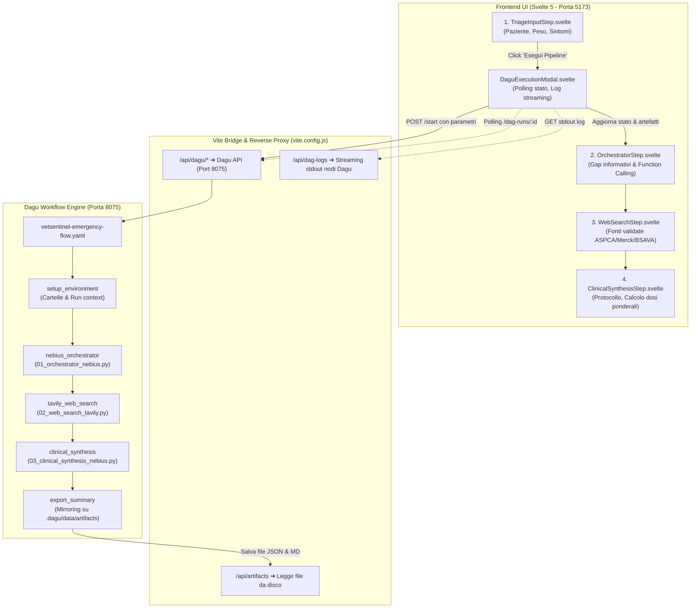
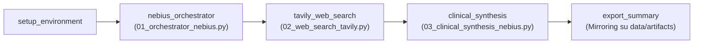

Questa applicazione è **VetSentinel**, un sistema di **Triage Clinico Veterinario & Decision Support per Emergenze Tossicologiche**. 

L'architettura è suddivisa in due anime principali strettamente connesse:
1. **Il Frontend UI** ([HackDashboard](HackDashboard)): Interfaccia reattiva moderna realizzata in **Svelte 5** (Runes), **TailwindCSS** e **DaisyUI**, dotata di animazioni con easing fluido, telemetria in tempo reale, monitoraggio parametri vitali ed esecuzione interattiva dei DAG.
2. **Il Backend Orchestrator Dagu & Python** ([.dagu/dags](.dagu/dags) & [app/py](app/py)): Motore di orchestrazione a grafo ([Dagu](dagu) su porta 8075) che coordina una pipeline scientifica in Python con **Nebius Token Factory (LLM)** e **Tavily Web Search Specialist**.

---

### 🗺️ Architettura Generale del Flusso



---

## 🖥️ 1. Tutte le Logiche dal Lato UI (Frontend)

L'applicazione si trova in [HackDashboard/src/apps/admin/routes](HackDashboard/src/apps/admin/routes).

### A. Shell Clinica e Layout Globale ([+layout.svelte](HackDashboard/src/apps/admin/routes/+layout.svelte))
- **Sistema di Temi Ospedalieri**: Permette di selezionare tra 12 palette ospedaliere cliniche (es. *Surgical Emerald*, *ICU Forest*, *Trauma Night*, *Toxicology Red*), memorizzate nel `localStorage` e applicate via attributo `data-theme`.
- **Top Navbar con Telemetria**: Visualizza lo stato del nodo Dagu, il badge dei database scientifici accreditati (*ASPCA*, *Merck*, *BSAVA*, *PubMed*) e il pulsante per il protocollo d'urgenza.
- **Banner Parametri Vitali & ECG Live** ([ClinicalVitalsBanner.svelte](HackDashboard/src/apps/admin/routes/ClinicalVitalsBanner.svelte)):
  - Disegna un tracciato elettrocardiografico animato continuo (SVG dinamico del ritmo cardiaco QRS con scanner sweep).
  - Permette di alternare tra specie canina e felina con range di frequenza cardiaca (HR), frequenza respiratoria (RR), SpO2, temperatura corporea e pressione arteriosa (BP).
- **Modal Emergenza Tossicologica 24/7** ([EmergencyProtocolModal.svelte](HackDashboard/src/apps/admin/routes/EmergencyProtocolModal.svelte)):
  - Accesso immediato ai numeri di telefono dei centri antiveleni (*ASPCA APCC*, *Pet Poison Helpline*, *VPIS Europeo*) con copia in un click negli appunti.
  - Tabella di riferimento rapido per antidoti d'urgenza (Naloxone, Atropina, Vitamina K1, Emulsione Lipidica Intralipid 20%, Apomorfina).

---

### B. Il Wizard a 4 Fasi del Triage ([+page.svelte](HackDashboard/src/apps/admin/routes/+page.svelte))
Gestisce lo stato reattivo con i Runes di Svelte 5 (`$state(currentStep)`):

#### 1. Fase 1: Inserimento Dati Paziente ([TriageInputStep.svelte](HackDashboard/src/apps/admin/routes/TriageInputStep.svelte))
- **Scelta della Specie**: Gatto, Cane, Furetto, Coniglio, Cavallo, Animale Esotico.
- **Preset Clinici Istantanei**:
  - *Cane · Cioccolato Fondente* (teobromina, tossicità cardiaca).
  - *Gatto · Giglio da vaso reciso* (Lilium, necrosi tubulare acuta renale).
  - *Cane · Sovradosaggio Amlodipina 10mg* (calcio-antagonista, shock ipotensivo).
  - *Coniglio · Stasi Gastrointestinale* (specie non-vomitante, analgesia e procinetici).
  - *Cane · Puntura da Zecche* (zoppia migrante, borreliosi/anaplasmosi).
- **Chip Sintomi Rapidi**: Permette di cliccare per aggiungere/rimuovere sintomi comuni (es. *Ipereccitazione*, *Vomito ripetuto*, *Scialorrea*, *Letargia*).
- **Calcolo Dinamico Taglia & Peso**: Regolazione incrementale del peso con visualizzazione contemporanea in kg e libbre (lbs) e categoria di taglia.

#### 2. Fase 2: Orchestrazione Clinica Nebius ([OrchestratorStep.svelte](HackDashboard/src/apps/admin/routes/OrchestratorStep.svelte))
- **Identificazione Fisiopatologica**: Riconosce la peculiarità chimico-biologica del paziente (es. deficit costitutivo di glucuronidazione nel gatto, blocco recettoriale L-type nel cane).
- **Gap Informativi Critici**: Elenca i punti oscuri che un veterinario deve chiarire prima di somministrare farmaci (es. identificazione tassonomica della pianta, stima del tempo dall'ingestione, controindicazioni all'emesi).
- **Function Calling**: Mostra l'intento dell'LLM di interrogare Tavily con query mirate e filtri sui domini autorevoli.
- **Semafori di Urgenza & Finestre Temporali**: Calcolo del rischio in base alle ore trascorse (es. finestra salvavita entro 18 ore per Lilium, <2 ore per emesi).

#### 3. Fase 3: Ricerca Scientifica Autorevole ([WebSearchStep.svelte](HackDashboard/src/apps/admin/routes/WebSearchStep.svelte))
- **Whitelist Domini**: Filtra rigorosamente solo fonti accreditate (`aspca.org`, `merckvetmanual.com`, `bsava.com`, `ncbi.nlm.nih.gov`, `ema.europa.eu`).
- **Card Risultati Estratti**: Mostra il titolo dello studio, la percentuale di rilevanza clinica, il riassunto depurato da pubblicità e i punti chiave d'azione.
- **Origine Dati Ibrida**: Se Dagu ha completato un'esecuzione reale, mostra i documenti estratti da Tavily (`02_tavily_search_result.json`); altrimenti fornisce la casistica clinica pre-calcolata.

#### 4. Fase 4: Sintesi & Calcolo Dosaggi ([ClinicalSynthesisStep.svelte](HackDashboard/src/apps/admin/routes/ClinicalSynthesisStep.svelte))
- **Tre Decisioni Cruciali Immediate**:
  1. *Induzione del Vomito*: SI / NO (evidenziando controindicazioni assolute, es. specie che non vomitano o gatti con letargia per rischio ab ingestis).
  2. *Carbone Attivo*: SI / NO / Seriato (con/senza sorbitolo).
  3. *Antidoto / Terapia Mirata*: (es. Fluidoterapia Ringer Lattato al doppio del mantenimento, emulsione lipidica ILE, calcio gluconato).
- **Tabella Dosaggi Personalizzata al Peso del Paziente**: Formula matematica interattiva ($dose = peso \times standard$) con via di somministrazione, formulazione e note di monitoraggio.
- **Export & Condivisione**: Copia negli appunti dell'intero referto medico in formato Markdown per la cartella clinica.

---

### C. Connessione Real-Time tra UI e Dagu ([daguService.js](HackDashboard/src/apps/admin/routes/daguService.js) & [DaguExecutionModal.svelte](HackDashboard/src/apps/admin/routes/DaguExecutionModal.svelte))

Quando l'utente clicca su **"Esegui Pipeline Dagu"**:
1. `buildDaguParams(patient)` genera la stringa dei parametri:
   ```bash
   SPECIES="Cat" BREED="European Shorthair" WEIGHT="4.0" PRIORITY="critical" SYMPTOMS="..."
   ```
2. Effettua una chiamata `POST /api/dagu/dags/vetsentinel-emergency-flow/start` con il body JSON.
3. Il modale riceve il `dagRunId` e attiva un loop di polling ad alta frequenza (ogni **800ms**) verso `/api/dagu/dags/vetsentinel-emergency-flow/dag-runs/{dagRunId}`.
4. **Streaming Log Live**: Mentre ogni step esegue, la UI interroga `/api/dag-logs?path=...` visualizzando l'output da terminale di Python direttamente nel tab dei log.
5. **Completamento & Sync**: Quando lo stato diventa `succeeded`:
   - Interroga `/api/artifacts` per recuperare tutti i file JSON e Markdown generati.
   - Chiama `onWorkflowComplete(artifacts)` in `+page.svelte`.
   - La pagina aggiorna il paziente con i dati effettivi dell'inferenza e sposta automaticamente l'utente allo **Step 2**, sostituendo i dati statici con quelli generati in real-time.

---

## ⚙️ 2. Tutte le Logiche dal Lato Dagu & Backend Python

Il workflow è definito in [.dagu/dags/vetsentinel-emergency-flow.yaml](.dagu/dags/vetsentinel-emergency-flow.yaml) ed è strutturato come un grafo aciclico diretto (DAG).

### Il Grafo dei Nodi del DAG:



### Dettaglio Logico di Ciascun Nodo:

#### 1. `setup_environment` (Bash)
- Riceve le variabili d'ambiente passate da Dagu (`$SPECIES`, `$BREED`, `$WEIGHT`, `$SYMPTOMS`, `$PRIORITY`).
- Crea la directory degli artefatti per il run corrente (`${context.paths.artifacts_dir}`) e la cartella centrale condivisa (`$DAGU_HOME/data/artifacts/vetsentinel`).

#### 2. `nebius_orchestrator` ([01_orchestrator_nebius.py](app/py/01_orchestrator_nebius.py))
- **Modello LLM**: Esegue `GLM-5.3-Flash` (`zai-org/GLM-5.3-Flash`) su **Nebius Studio AI** con `response_format: {"type": "json_object"}`.
- **Logica**:
  1. Analizza anamnesi, specie e peso.
  2. Identifica i **gap informativi clinici** (gravità: *critico*, *alto*, *medio*).
  3. Esegue un **Function Calling sintetico** (`tavily_veterinary_specialist_search`) generando da 3 a 5 query mirate per Tavily e la whitelist di domini.
- **Metriche**: Calcola il **TTFT** (Time To First Token) in millisecondi e il throughput stimato in token/secondo.
- **Artefatti Salvati**:
  - `01_orchestrator_result.json` (dati strutturati per lo step successivo).
  - `01_orchestrator_report.md` (report leggibile).

#### 3. `tavily_web_search` ([02_web_search_tavily.py](app/py/02_web_search_tavily.py))
- **Logica**:
  1. Carica `01_orchestrator_result.json` prodotto dal nodo precedente (recuperando query e whitelist).
  2. Interroga l'API di Tavily (`https://api.tavily.com/search`) con `search_depth: "advanced"`.
  3. Applica un filtro rigido escludendo social media e siti generalisti (`exclude_domains: ["pinterest.com", "facebook.com", "instagram.com"]`) e includendo solo la whitelist veterinaria.
  4. Pulisce il testo da ads/cookie tracker e assegna uno score di pertinenza clinica.
- **Artefatti Salvati**:
  - `02_tavily_search_result.json`.
  - `02_web_search_report.md`.

#### 4. `clinical_synthesis` ([03_clinical_synthesis_nebius.py](app/py/03_clinical_synthesis_nebius.py))
- **Logica**:
  1. Aggrega i dati del paziente dello Step 1 e i documenti scientifici dello Step 2.
  2. Determina la **diagnosi presuntiva** e compila il protocollo tripartito:
     - **Induzione dell'emesi**: Valuta stato neurologico (vigile vs letargico/comatoso) e principio attivo.
     - **Carbone attivo**: Calcola la dose d'attacco (1-2 g/kg) e l'uso del catartico (sorbitolo 70%).
     - **Terapia specifica**: Protocolli di diuresi forzata continua (es. Ringer Lattato a 6-8 ml/kg/h) o chelanti/antagonisti.
  3. Genera la **tabella dosaggi ponderali**, moltiplicando per il peso esatto del paziente ($kg$).
  4. Compila le citazioni bibliografiche obbligatorie (*Evidence-Based Veterinary Medicine*).
- **Artefatti Salvati**:
  - `03_clinical_synthesis.json`.
  - `final_clinical_emergency_sheet.md` (scheda clinica finale).
  - `_index.md` (indice per la visualizzazione immediata negli artefatti di Dagu).

#### 5. `export_summary` (Bash)
- Esegue un mirror `cp -r` degli artefatti dalla cartella del run alla cartella centralizzata `$DAGU_HOME/data/artifacts/vetsentinel`.
- In questo modo la UI può accedere agli ultimi artefatti senza dover conoscere l'ID del run.

---

## 🌉 3. Il Ponte di Collegamento: Vite Bridge ([vite.config.js](HackDashboard/vite.config.js))

Per permettere al browser di comunicare in modo trasparente e senza problemi di CORS con Dagu e con i file salvati su disco, Vite implementa un plugin personalizzato `vetsentinelBackendBridge`:

1. **Proxy `/api/dagu/*`**:
   - Riscrive l'URL verso `http://127.0.0.1:8075/api/v1/*`.
   - Permette all'interfaccia di avviare DAG e leggere lo stato dei nodi.
2. **Middleware `/api/artifacts`**:
   - Legge la cartella `../.dagu/data/artifacts/vetsentinel`.
   - Se interrogato senza parametri, crea un **mega-payload JSON aggregato** contenente tutti gli artefatti contemporaneamente (`orchestrator`, `tavily`, `synthesis`, e i rispettivi Markdown).
   - Se interrogato con `?name=filename`, restituisce il singolo file JSON o Markdown.
3. **Middleware `/api/dag-logs`**:
   - Riceve il percorso su disco del file di stdout generato da Dagu (`?path=/path/to/node.stdout`).
   - Verifica la sicurezza (che il path sia all'interno del workspace) e invia il log in streaming alla UI.

---

## 🚀 4. Script di Orchestrazione Generale ([start.sh](start.sh))

Lo script di avvio principale esegue e gestisce in parallelo l'intero stack:
- Attiva l'ambiente virtuale Python `.venv` (Poetry).
- Avvia **PocketBase** (porta `8090`).
- Avvia il server **Dagu** (porta `8075`).
- Avvia il server frontend **HackDashboard** con Bun/Vite (porta `5173`).
- Include trap di segnale (`SIGINT`/`SIGTERM`) per terminare pulitamente tutti i processi in background all'uscita.